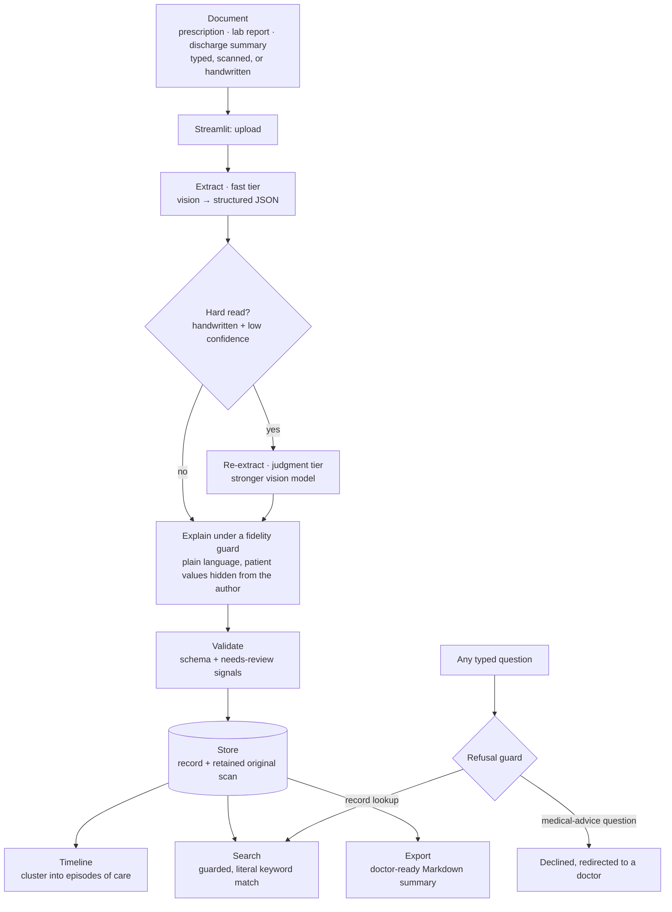

# Medical Records and Prescription Tracker

**Turn a pile of messy prescriptions and reports into a readable, searchable personal health record.** Upload a document soon after a visit and the tool reads it (including handwritten and low-quality scans), structures it, explains it in plain language, files it on a timeline, and lets you find it again months later. When you change doctors, it exports a clean, facts-only summary to hand over.

It is built for a patient (or a family member) keeping track of their own care, not for a clinic.

> ⚠️ This is a **record aid, not medical advice.** It organises and explains what a document says. It never diagnoses, never rates how serious anything is, and never tells you to start, stop, or change a treatment. A built-in guard refuses those questions and points you back to a doctor.

---

## Live demo

**[Try the live app](https://medical-records-tracker-jwcur2ngo2aixetfugvtti.streamlit.app/)**. It opens on a timeline of synthetic sample records, so you can explore the reading, the episodes, search, and the doctor-ready export straight away with no upload and no key. (Streamlit's free tier can take a few seconds to wake if the app has been idle.)

Trying it on your own document is available behind a demo password: those uploads are processed live and kept **only in your browser session**, never saved to the app and never visible to anyone else.

## The problem

Your medical history ends up scattered across a drawer of paper, a camera roll, and a few email attachments. Months later, none of it is findable: you cannot remember which visit the blood test belonged to, the prescription is in a doctor's shorthand you cannot read, and when you see a new doctor you arrive with a pile of photos instead of a history.

The hard part is that a lot of these documents are **handwritten or badly scanned**. Traditional OCR turns a doctor's scrawl into garbage text, and a rules-based parser cannot cope with the endless variety of prescription and report layouts. This tool sends the image straight to a vision model that reads the document the way a person would, then wraps that reading in guardrails so a bad read is flagged rather than trusted.

## What it does

The whole loop is: **upload → read → explain → file → find → hand over.**

- **Reads the document.** Prescriptions, lab reports, and discharge summaries, typed or handwritten, as images or PDFs, into one structured record (provider, date, diagnosis as written, medications with dose and frequency, investigations with values, advice, follow-up).
- **Explains it in plain language.** A short, plain-English gloss of what a diagnosis or a medicine is, sitting next to (never replacing) the verbatim text.
- **Flags what needs a second look.** Every record carries a `needs review` verdict, so a low-confidence read of a smudged scan is surfaced, not silently accepted.
- **Files it on a timeline.** Records are clustered into **episodes of care** (a course of treatment and its follow-ups), newest first.
- **Lets you find it again.** A guarded keyword search over what is actually written on the records.
- **Exports a doctor-ready summary.** A clean, facts-only Markdown handover, grouped by episode, that you can download and give to a new doctor.

## Why it's built the way it is (the interesting part)

**1 · The safety boundary is part of the spec, not an afterthought.** The tool explains and organises and points to a doctor. Anything that asks it to practise medicine (a diagnosis, "how bad is this?", "should I stop this drug?", a dosing suggestion, a prognosis) is caught by a deterministic **refusal guard** and redirected. The guard runs on the question *before* any record is searched, so the tool cannot be talked into an opinion.

**2 · Two model tiers, and a document earns the expensive one.** A fast model does the everyday reading; a stronger judgment model is reserved for hard vision and for writing the plain-language explanations. A record is **escalated** from fast to judgment only when it is genuinely hard (a handwritten prescription read with low confidence). This came straight out of testing: on real handwritten prescriptions the fast tier confidently invented a plausible dosing (a "7 days" course for a cream that had no duration written on it), while the judgment tier correctly left it blank. Escalation, not a longer prompt, was the fix.

**3 · The explanation author is deliberately starved of the patient's data.** The component that writes the plain-language gloss is shown only the *name* of a diagnosis or medicine, never the patient's own values or flags. It structurally cannot say "your sugar is high" because it never sees the number: it can only explain what HbA1c *is*. This makes it impossible for the friendly explanation to quietly become an interpretation.

**4 · Lab flags are carried only if they are printed.** If the report prints "HIGH" next to a value, that flag is kept. The tool never computes a flag itself by comparing a value to a reference range, because deciding a value is abnormal is a clinical call, not a transcription.

**5 · Episodes are clustered by deterministic code, not by the model.** Records are grouped using a union-find over literal signals (same provider, same medicine, a shared diagnosis keyword) that are also close in time (within 120 days). There is no learned "these conditions are related" step, which avoids wrongly merging two unrelated long-term conditions into one episode.

**6 · A privacy firewall runs down the middle of the repo.** Your real records live in a local, git-ignored folder and never leave your machine. Only clearly synthetic sample records are committed. On the hosted demo, uploads are session-only and never written to shared storage, so one visitor can never see another's document.

## How it works



In plain terms: the document is read by a vision model, hard reads are re-read by a stronger model, the reading is explained without ever exposing the patient's values to the explainer, then validated and stored alongside the original scan. From storage it feeds the timeline, search, and export. Every typed question passes the refusal guard first.

## A quick example

**Input:** a photo of a handwritten dental prescription.

**What the tool reads and files:**

| Field | Value |
|---|---|
| Diagnosis (as written) | `Irrev. pulpitis 46` |
| Plain-language note | *Irreversible pulpitis is inflammation of the soft inner tissue (pulp) of a tooth that does not settle on its own; "46" refers to a specific tooth in dental notation.* |
| Medication | `Augmentin 625 (tablet): 1 tablet, twice daily, 5 days` |
| Medication | `Pan 40 (capsule): 1 capsule, once daily (morning), before food` (no duration written, so **left blank**) |
| Confidence / flags | high · `handwritten` |

**What it refuses:**

| You ask | It answers |
|---|---|
| "Is irreversible pulpitis serious?" | Declined: this is a record aid, not medical advice. Please ask a doctor. |
| "Should I stop the Augmentin early?" | Declined: I can't advise on changing a treatment. |
| "When did I last see a dentist?" | Answered: it searches your records and returns the matching visit. |

## The output

The doctor-ready export is plain Markdown, facts-only, grouped by episode of care, newest first. A trimmed real example from the sample records:

```markdown
# Medical records summary

**Patient:** Rahul Mehta (M, 32)
**Period:** 2026-01-15 to 2026-04-02
**Records:** 4
**Generated:** 2026-08-18

_This is a record aid, not medical advice. Digitised from the patient's own
documents; the original scans are the source of truth._

## Dr. Anil Rao · 2 records · Jan 2026 to Feb 2026

### 2026-01-15 · lab report
- **Provider:** Dr. Anil Rao · MedLab Diagnostics
- **Investigations:**
    - HbA1c = 7.8 % [HIGH] (ref < 5.7)
    - Fasting Plasma Glucose = 142 mg/dL [HIGH] (ref 70 - 100)
    - Total Cholesterol = 185 mg/dL (ref < 200)
- **Original on file:** sample_03_diabetes_lab.png

### 2026-02-10 · prescription
- **Provider:** Dr. Anil Rao · General Medicine · Sunrise Family Clinic
- **Diagnosis (as stated):** Acute pharyngitis
- **Medications:**
    - Amoxicillin 500 mg (Tablet): 1 tablet, twice daily, 5 days
    - Paracetamol 650 mg (Tablet): 1 tablet, three times a day, 3 days
- **Advice (verbatim):** Warm saline gargles. Rest and plenty of fluids.
- **Original on file:** sample_01_pharyngitis.png
```

Note that the printed `[HIGH]` flags are carried through exactly as the report printed them, and the plain-language notes are deliberately **left out** of the doctor handover: a doctor wants the facts, not the lay glosses.

## Tech stack

- **Python 3.12**
- **Streamlit** for the single-page web app (upload, review, timeline, search, export)
- **Anthropic Claude** (official SDK), tiered on cost and difficulty: a fast model (`claude-sonnet-5`) for everyday reading, a stronger model (`claude-opus-4-8`) for hard vision and for the plain-language explanations
- **jsonschema** (Draft 2020-12): the record shape is schema-defined and every extraction is validated against it
- **Pillow** and **PyMuPDF** for image handling and rendering PDF pages to images for the vision model
- **python-dotenv** for loading `ANTHROPIC_API_KEY` from a local `.env` during development
- **pytest** for the test suite

## How it's tested (evals)

Testing is built into the design, at three levels:

- **An automated suite of 112 tests** (`pytest`) covers the parts where consistency matters and the model is not involved: schema validation and the `needs review` signals, the refusal guard's categories, the explanation fidelity guard (that it never introduces a number or an instruction), storage round-trips, the full ingest chain, episode clustering, guarded search, and the export format.
- **Real-document testing** against actual handwritten prescriptions is what shaped the pipeline. It surfaced the fast tier's invented-dosing failure (see design decision 2), which the fast→judgment escalation now handles. That finding is the reason escalation exists.
- **A labelled eval set** (`eval/eval_set/`) pairs each synthetic sample with its ground-truth fields, expected confidence, and expected `needs review` verdict, ready for a scorer that measures extraction accuracy, explanation fidelity, correct refusal, and needs-review correctness. The scorer itself (`eval/run_eval.py`) is the next piece to build; the labels are in place.

## Modes and privacy

- **Real mode** (a key is present locally): you upload your own documents; they are stored privately under a git-ignored `local_records/` folder and never leave your machine.
- **Demo mode** (a deploy, or no key, or `APP_MODE=demo`): read-only browsing of the synthetic records in `demo_cache/`. Uploading can be unlocked with a demo password; those uploads are processed live and kept **only in the visitor's browser session**, never written to shared storage. A deploy always defaults to demo, even if a key is set, so a hosted app never silently runs real mode.

The original scan is always retained and shown next to the extraction, because the original is the source of truth and the structured data is a convenience layer that can be wrong.

## Scope and honest limitations

- **It advises nothing.** Every output is a transcription, an organisation, or a neutral explanation, never a clinical judgment.
- **The eval scorer is not built yet.** The test suite and the labelled set exist; the one-command accuracy scorer over that set is still to come.
- **Episode clustering is deterministic and literal.** It groups on exact provider, medicine, and diagnosis-keyword matches within a time window; it will not spot that two differently-named conditions are actually related.
- **No accounts, database, or multi-user workflow.** It is a focused single-user tool.
- **Manual episode edits (merge/split) are not implemented.** Clustering is automatic only.

## Run it locally

```bash
git clone https://github.com/sachinj9074/Medical-Records-Tracker.git
cd Medical-Records-Tracker

python -m venv .venv
.venv\Scripts\activate        # Windows
# source .venv/bin/activate   # macOS/Linux

pip install -r requirements.txt
```

Copy the example env file and paste your own key:

```bash
cp .env.example .env          # then edit ANTHROPIC_API_KEY
```

Then run the app:

```bash
streamlit run src/app.py
```

With a key present the app starts in **real mode** against a private, git-ignored store. Never commit `.env`.

## Deploy the public demo (Streamlit Community Cloud)

Push the repo, then at [share.streamlit.io](https://share.streamlit.io) choose **New app**, pick this repo, the `main` branch, and `src/app.py`.

- **Browse-only demo (no key, zero cost):** deploy as-is. With no key present the app runs read-only over the synthetic records in `demo_cache/`.
- **Interactive demo (visitors can try their own upload, behind a password):** under the app's **Secrets**, add:

  ```toml
  APP_MODE = "demo"
  ANTHROPIC_API_KEY = "sk-ant-...  # use a dedicated, spend-capped demo key"
  DEMO_PASSWORD = "a-password-you-share-deliberately"
  MAX_UPLOADS_PER_SESSION = "3"
  ```

  Uploads are then processed live and kept only in the visitor's session. Use a **spend-capped** key (set a hard limit in the Anthropic console) so a leaked password cannot run up unbounded cost. The deploy stays in demo mode regardless, so the public URL never runs persistent real mode and never touches your real records.

## Roadmap

- The one-command eval scorer over the labelled set (extraction accuracy, explanation fidelity, correct refusal, needs-review correctness)
- Manual episode merge and split
- A short screen-recording walkthrough of the app
- PDF multi-page and multi-document handling
- Broader document types (imaging reports, vaccination records)

---

*Curious about the engineering? The full spec (schema, safety boundary, and the design decisions) is in [PROJECT_SPEC.md](PROJECT_SPEC.md), and the build philosophy is in [FRAMEWORK.md](FRAMEWORK.md).*
